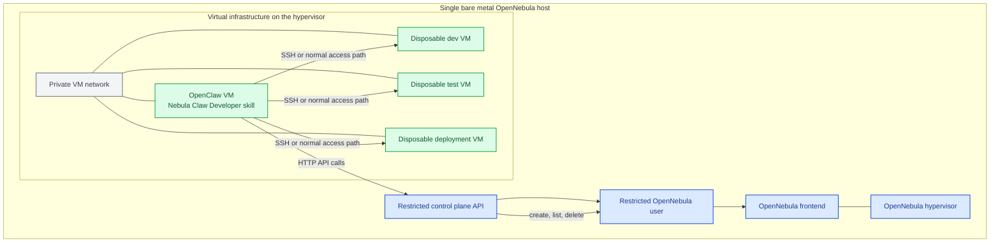

# nebula-claw-developer

Reference repository for the Nebula Claw Developer skill and its supporting example architecture.

## Repository layout

- `nebula-claw-developer/` — the publishable OpenClaw skill intended for ClawHub
- `opennebula-restricted-control-plane/` — reference restricted API implementation used by the skill
- `installation/` — environment setup notes and installation guidance for the reference lab

## What is publishable

The `nebula-claw-developer/` folder is the skill package boundary.

It contains:

- `SKILL.md`
- `references/`
- `scripts/`

That folder is the unit to publish to ClawHub.

## What is not part of the skill package

The rest of the repository is supporting implementation and documentation for the example environment:

- `opennebula-restricted-control-plane/` is not part of the skill bundle
- `installation/` is not part of the skill bundle

These folders are useful for operators who want to stand up the same architecture, but they should not be bundled into the published skill.

## Intended architecture

- OpenNebula runs on a single bare metal host that serves as both frontend and hypervisor.
- A NATed private virtual network hosts the OpenClaw VM and the disposable workload VMs.
- The restricted API runs on the bare metal OpenNebula host.
- The restricted API performs VM actions through a separate non-admin OpenNebula user with access only to curated resources.
- The OpenClaw VM uses the published skill to call the restricted API, then connects to the created VMs for development, testing, and deployment work.

### Reference architecture diagram



## Publish workflow

From the repository root, publish the skill folder with the ClawHub CLI:

```bash
clawhub login
clawhub whoami
clawhub skill publish ./nebula-claw-developer \
  --slug nebula-claw-developer \
  --name "Nebula Claw Developer" \
  --version 1.0.0 \
  --changelog "Initial public release" \
  --tags latest
```

## Local test workflow

To test locally in an OpenClaw workspace, copy or symlink `nebula-claw-developer/` into a workspace `skills/` directory, then start a new session or restart the gateway.

Example:

```bash
mkdir -p ~/.openclaw/workspace/skills
cp -a ./nebula-claw-developer ~/.openclaw/workspace/skills/nebula-claw-developer
openclaw gateway restart
```
